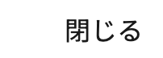

## Figma 実装検証レポート

**結果: ✅ 差分なし**（2 要素、許容 ±1px）

| 項目 | 値 |
| --- | --- |
| 検証したコミット | `efaa931b1145389870191f8fe8383e485faec758` |
| 検証したページ | file:///private/tmp/claude-501/-Users-ct/27a74b9b-bcb7-4c01-9542-ef2b9b637984/scratchpad/verify-proj/good.html |
| Figma ファイル | デジタル庁デザインシステム デザインデータ v2.18.0 (Community) (`daNmBDmK1bbov1O2zoZaeL`) |
| Figma の版 | version `2402356268370629014` / 最終更新 2026-09-23T09:12:08Z |
| Figma から取得した日時 | 2026-09-23T10:01:54.852Z |
| nodes.json の SHA-256 | `2b9dbd8eef1e164703349d6998473bf23e618750510eb3482116e44fe47e178e` |
| ブラウザ | Chromium 153.0.8010.12 |
| 実行日時 | 2026-09-23T10:07:46.795Z |

### 見た目（左: Figma の書き出し / 右: 実装のスクリーンショット）

参考用。判定には使っていない（判定は下の数値のみ）。

| node | Figma | 実装 |
| --- | --- | --- |
| `31289:2` State=Default |  |  |
| `8403:33322` ガイドラインを見る |  |  |

### 全要素の実測値（figma / 実装）

| 判定 | id | name | font-size | line-height | letter-spacing | weight | 幅 |
| --- | --- | --- | --- | --- | --- | --- | --- |
| ✅ OK | `31289:5` | 閉じる | 16 / 16 | 16 / 16px | 0.32 / 0.32px | 400 / 400 | 49 / 48.97 |
| ✅ OK | `8403:33322` | ガイドラインを見る | 20 / 20 | 35 / 35px | 0.8 / 0.8px | 500 / 500 | 187 / 187.2 |

このレポートは figma-impl/scripts/verify.js が生成・投稿した。手作業や AI による編集は経ていない。実行コマンド: `node verify.js --url file:///private/tmp/claude-501/-Users-ct/27a74b9b-bcb7-4c01-9542-ef2b9b637984/scratchpad/verify-proj/good.html --nodes /private/tmp/claude-501/-Users-ct/27a74b9b-bcb7-4c01-9542-ef2b9b637984/scratchpad/verify-proj/.figma-impl/tmp/nodes.json --pr 6`
