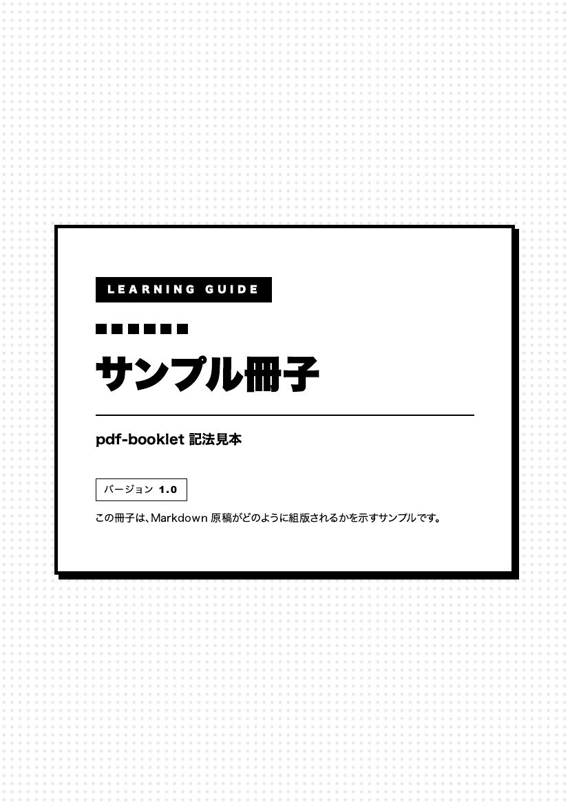
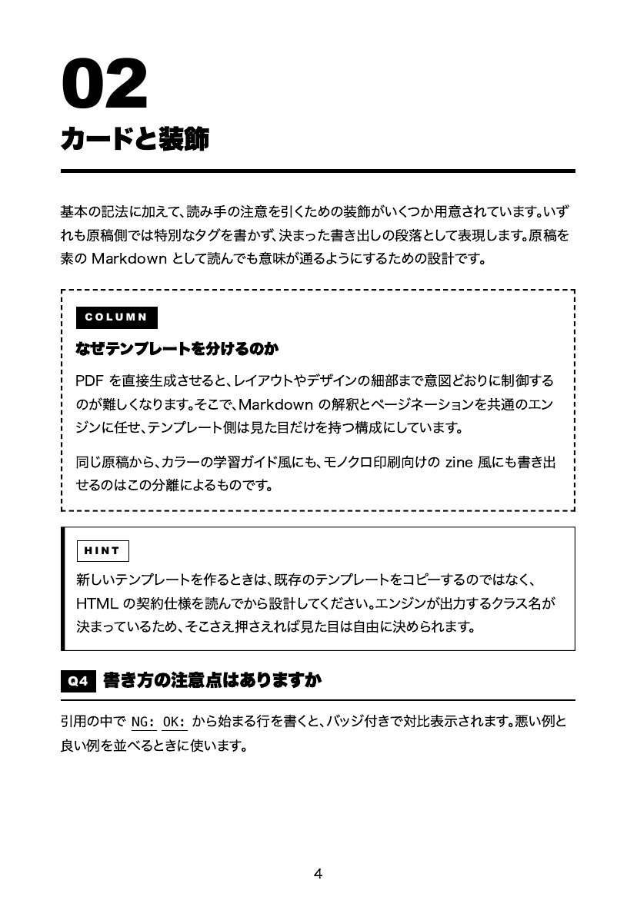

# pdf-booklet

Markdown 原稿とデザインテンプレートから冊子 PDF を生成する Claude Code スキル。

同じ原稿を、テンプレートを差し替えるだけで異なるデザインで書き出せる。Markdown の解釈（章扉・カード・表への変換）とページネーションは `lib/engine.py` が全テンプレート共通で担当し、テンプレート側は見た目（CSS）だけを持つ。

## 出力例

以下はすべて **同一の原稿**（[`docs/sample.md`](docs/sample.md)）から生成したもの。

### ソフトUI × 章カラー制 (`soft-ui-chapter-color`)

明朝ディスプレイ体のタイトル、章ごとに変わるアクセントカラー、カード型レイアウト。学習資料・入門ガイド向け。

| 表紙 | カード・装飾 |
|---|---|
|  |  |

### ステンシル・モノクロ (`stencil-mono`)

黒1色で組む、リソグラフ風のデザイン。ベタ面の白抜きラベル、巨大な章番号が特徴。同人誌・zine のモノクロ印刷入稿向け。

| 表紙 | カード・装飾 |
|---|---|
|  |  |

章カラーはテンプレートのパレット定義から自動で割り当てられるため、原稿には色を書かない。モノクロ版はパレットをすべて黒にすることで、同じ原稿がそのまま単色で組まれる。

## 記法

| 原稿の書き方 | 変換結果 |
|---|---|
| `# タイトル — サブタイトル` + メタ情報 | 表紙（カード + タイトル + バージョンバッジ） |
| `## 第n章 ◯◯` | 章扉（章番号 + 章カラー割当） |
| `### Qn. ◯◯` | Q バッジ付き見出し |
| `### コラム: ◯◯` | COLUMN カード |
| `ヒント: ◯◯` で始まる段落 | HINT カード |
| `**第n章 この章で覚えること**` + 箇条書き | POINT カード |
| `覚え方: ◯◯` で始まる段落 | 章カラーの淡色チップ |
| リスト項目 `**用語**: 説明` | 用語で改行する2行構成 |
| 引用内の `NG:` / `OK:` | 赤/緑バッジ + 色付き行 |
| 表 | 章カラーヘッダの角丸カード |

## 使い方

Claude Code に自然文で依頼する。

```
原稿をPDFにして
```

直接実行する場合:

```bash
python3 lib/engine.py templates/<テンプレート名> <原稿.md> <出力.pdf>
```

生成後は主要ページ（表紙・章扉・装飾の多いページ）を画像で確認してから確定する。この確認手順はスキルの定義に組み込んである。

## 前提パッケージ

```bash
pip install markdown beautifulsoup4 playwright
playwright install chromium
brew install poppler   # pdftoppm / pdfunite
```

poppler が無い環境では、表紙のノンブル除外が機能せず、警告を出して全ページに入った状態で出力される。

## テンプレートの追加

`templates/` 直下にフォルダを作り、`style.css` と `template.json` を置く。この規約を満たせばスキル側の変更は不要。

出力される HTML 構造・CSS クラスの契約は [`lib/HTML_CONTRACT.md`](lib/HTML_CONTRACT.md) を参照。作成作業は `pdf-booklet-template-designer` スキルに任せられる。

## 原稿の書き方

改ページ崩れを避けるための注意点は [`lib/WRITING_GUIDE.md`](lib/WRITING_GUIDE.md) にまとめてある。表・カード類は分割されず常に1ページに丸ごと収まるため、極端に長いカードを作ると直前ページに大きな余白ができる。

自動判定で解決しない箇所は、原稿に手動マーカーを書いて個別に対処できる。

```
<!-- page-break -->    その位置で強制改ページ
<!-- space: 8mm -->    その位置に余白を挿入
```
